# AI Portal Architecture Diagram

```mermaid
graph TB
    subgraph "User Access Layer"
        Users[👥 End Users<br/>AD Credentials]
        Systems[🖥️ External Systems<br/>API Clients]
    end

    subgraph "AWS VPC - 10.0.0.0/16"
        subgraph "Public Subnet - Open WebUI"
            ALB[🌐 Application Load Balancer<br/>TLS 1.3 HTTPS<br/>ai.forora.com]

            subgraph "Open WebUI Instance"
                WebUI[🎨 Open WebUI<br/>Docker Container<br/>Port 8080]
                API[🔌 OpenWebUI API<br/>/api/v1/*<br/>Bearer Token Auth]
                WebUI --> API
            end

            ALB --> WebUI
        end

        subgraph "Public Subnet - Gateway"
            subgraph "Bedrock Gateway Instance"
                Gateway[⚡ Bedrock Gateway<br/>FastAPI Service<br/>Port 8000]
                GatewayAPI[📡 Ollama-Compatible API<br/>/api/tags<br/>/api/chat<br/>/api/generate]
                Gateway --> GatewayAPI
            end
        end

        subgraph "Private Subnet - Auth & Data"
            AD[🔐 AWS Managed Microsoft AD<br/>corp.aiportal.local<br/>LDAP Port 389]
            RDS[💾 PostgreSQL RDS<br/>User Data & Models<br/>Port 5432]
        end
    end

    subgraph "AWS Bedrock Service"
        Bedrock[🤖 AWS Bedrock Models]
        subgraph "Available Models"
            Claude[Claude 3.7 Sonnet<br/>Claude 3.5 Sonnet<br/>Claude 3 Haiku]
            Nova[Amazon Nova Pro/Lite]
            Llama[Meta Llama 3]
            Mistral[Mistral Large/7B]
            Qwen[Qwen 3 Coder]
        end
        Bedrock --> Claude
        Bedrock --> Nova
        Bedrock --> Llama
        Bedrock --> Mistral
        Bedrock --> Qwen
    end

    %% Authentication Flows
    Users -->|1. HTTPS Login<br/>AD Username/Password| ALB
    ALB -->|2. LDAP Auth Request| AD
    AD -->|3. User Validated| WebUI
    WebUI -->|4. Session Created| Users

    %% API Access Flow
    Systems -->|1. HTTPS Request<br/>OIDC Token| ALB
    ALB -->|2. Token Validation| API
    API -->|3. Authorized Response| Systems

    %% Model Inference Flow
    Users -->|5. Chat Request| WebUI
    WebUI -->|6. Model Inference<br/>Ollama API Format| Gateway
    Gateway -->|7. Converse API<br/>IAM Role Auth| Bedrock
    Bedrock -->|8. Model Response| Gateway
    Gateway -->|9. Formatted Response| WebUI
    WebUI -->|10. Display to User| Users

    %% Data Storage
    WebUI -.->|Store Users & Sessions| RDS
    API -.->|Query User Permissions| RDS

    %% Styling
    classDef userClass fill:#e1f5ff,stroke:#01579b,stroke-width:2px
    classDef webClass fill:#fff3e0,stroke:#e65100,stroke-width:2px
    classDef authClass fill:#f3e5f5,stroke:#4a148c,stroke-width:2px
    classDef aiClass fill:#e8f5e9,stroke:#1b5e20,stroke-width:2px
    classDef dataClass fill:#fce4ec,stroke:#880e4f,stroke-width:2px

    class Users,Systems userClass
    class ALB,WebUI,API,Gateway,GatewayAPI webClass
    class AD authClass
    class Bedrock,Claude,Nova,Llama,Mistral,Qwen aiClass
    class RDS dataClass
```



## Architecture Components

### 1. **User Access Layer**
- **End Users**: Authenticate via Active Directory credentials (LDAP)
- **External Systems**: Authenticate via OIDC tokens for API access

### 2. **Load Balancer & TLS Termination**
- **ALB**: Handles TLS 1.3 encryption, routes to Open WebUI
- **Domain**: https://ai.forora.com

### 3. **Open WebUI Instance**
- **Web Interface**: Chat UI for end users
- **API Server**: RESTful API for programmatic access
- **Authentication**:
  - LDAP for web users
  - OIDC/Bearer tokens for API clients

### 4. **Bedrock Gateway Instance**
- **Translation Layer**: Converts Ollama API format to AWS Bedrock Converse API
- **Model Discovery**: Dynamically lists available Bedrock models
- **IAM Authentication**: Uses EC2 instance role for Bedrock access

### 5. **Authentication & Data**
- **AWS Managed AD**: Centralized user authentication
- **PostgreSQL RDS**: Stores user profiles, sessions, model configurations

### 6. **AWS Bedrock**
- **19 ON_DEMAND Models**: Claude, Nova, Llama, Mistral, Qwen
- **Pay-per-token**: No infrastructure to manage

## Authentication Flows

### Web User Login (LDAP)
```
User → ALB (HTTPS) → Open WebUI → AD (LDAP) → Validate → Session Created
```

### API Client Access (OIDC)
```
System → ALB (HTTPS + OIDC Token) → OpenWebUI API → Validate Token → Authorized Response
```

### Model Inference
```
User/API → Open WebUI → Bedrock Gateway → AWS Bedrock → Model Response
```

## Security

- **TLS 1.3**: End-to-end encryption
- **IAM Roles**: No credentials in code
- **LDAP**: Active Directory integration
- **OIDC**: Token-based API authentication
- **VPC Isolation**: Private subnets for data & auth
- **Security Groups**: Strict network access control

## Key URLs

- **Web Interface**: https://ai.forora.com
- **API Endpoint**: https://ai.forora.com/api/v1/*
- **Health Check**: https://ai.forora.com/health
